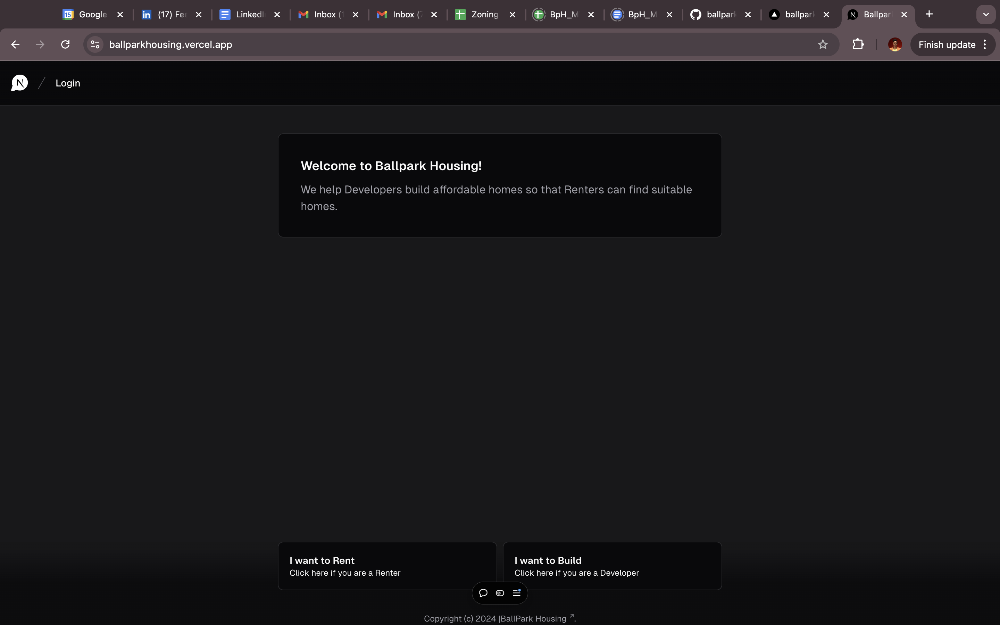
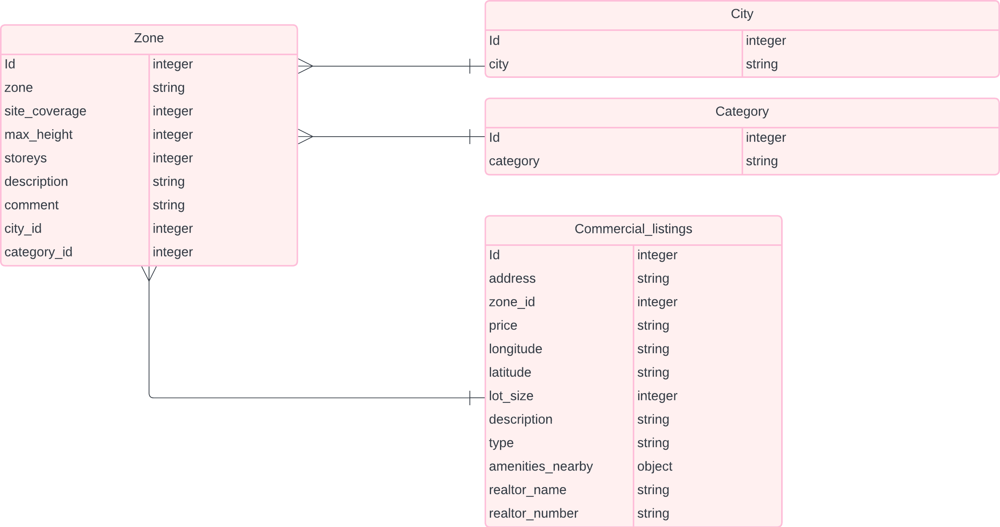

# Project Title

Ballpark Housing

## Overview

Ballpark Housing is an AI-powered web application that helps real estate professionals access, underwrite, and develop real estate projects.

### Problem Space

Canada is currently experiencing a housing crisis.
Renters are unable to find affordable homes because there's a supply gap.
This gap exists because Developers do not build as quickly as they should.

The bottleneck is caused by 3 major factors:

- Finding lots is an antiquated process that take months.
- Developers work with partial data because real estate development require domain knowledge that it is currently not cohesive and domiciled in one place.
- Building and Development permits are not streamlined and can take months to receive approvals.

This application aims to increase housing supply by helping real estate developers find lots, get into the right ballpark and build quicker.

### User Profile

Mom & Pop Developers

- looking for lots/deals that suit their development profile and risk appetite.
- do not have the resources that big firms have to hire multiple analysts to find and underwrite deals.
- are not knowledgebale about city plans, permitting processes and requirements.

Boutique Real Estate firms

- have some resources and want to find lots faster in order to develop more projects.
- spend months analysing and underwriting deals and so take several months to develop a project.

### Features

- As a user, I want to be able to find available lots within a city of interest
- As a user, I want to be able to see zoning and lot infrastructure information
- As a user, I want to be able to underwrite attractive deals quickly so that I have a good idea of project costs
- As a user, I want a justification for the deals I find on Ballpark Housing
- As a user, I want to be able to save my query/search histories

## Implementation

### Tech Stack

- React
- Javascript
- Vercel
- Heroku
- Mysql
- Client libraries:
  - react
  - react-router
  - Next.js
  - axios
- Server libraries:
  - knex
  - express

### APIs

Open ai
Google maps
Pinecone

### Sitemap

- the site will be a single page application with a chatgpt user interface
- queries will be made via prompt engineering
- prompts will be led by the app
- a history of user queries will be saved in a side panel

### Mockups

### SPA UI

### Data

- Data consists of free, publicly available real estate listings from Zillow and Realtor.ca
- Data has already been scraped using the Python library Beautiful Soup
- Data is currently in json format
- Data consists:
  - lot addresses
  - zoning information
  - images of the lots
  - pricing
  - amenities
  - listing description

### DataBase Schema

### Endpoints

.Get/lots

- this will get all available lots within a specified city

.Get/lots/category

- this will get all lots for a specific category - residential, commercial or mixed-use

.Get/lots/category/zone

- this will get lots for a specific category that correspond to specific zones

## Roadmap

- Preprocess data and migrate them into two tables
- listings table
- city zoning table
- build server side
  - create mysql db with knex
  - create endpoints and test all endpoints on postman/thunder client
- build client side
  - clone vercel's chatbot ui app
  - develop front end functionality
- connect front end and backend
- deploy app

---

## Future Implementations

- develop heatmap to show users additional relevant data
  - areas with high development activity
  - areas with high permitting and approvals
  - city nodes
  - future city expansion plans
  - traffic data
  - population growth
- develop ML model to scan site plans and pre-assess permitting application documents

### How to Run Ballpark Housing App

- set up backend with env variables
- run backend server - npm run start
- set up frontend with env variables
- run frontend - npm run dev
